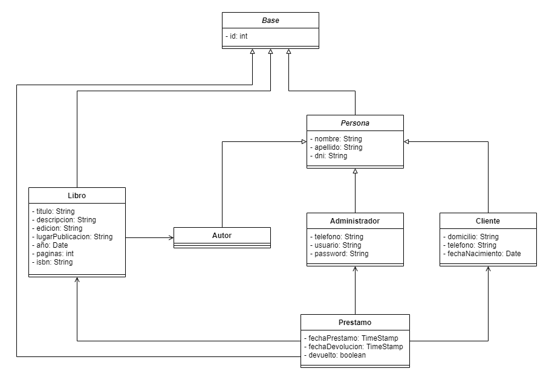
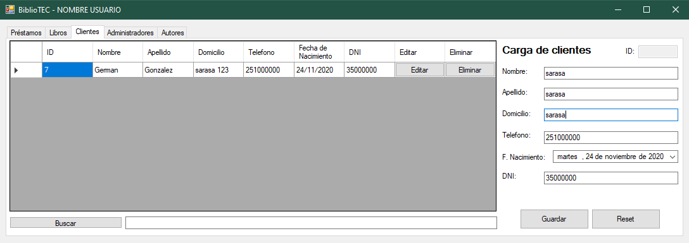

# Trabajo Final Laboratorio II

## Integrantes
* Veloci, Franco
* Luna, Matias
* Bazze Gothe, Agustin

## Tema seleccionado
* Biblioteca

## Diagrama de Clases

## Finalidad
Sistema para Biblioteca (Administrador de libros, Administrador de clientes y Administrador de préstamos).
* Rol: administrador de biblioteca.
* Beneficio: desligarse del papel y administración rápida.

## Documentacion
El sistema cuenta con multiples funcionalidades para administrar el uso de una biblioteca basica contando asi con los siguientes CRUDS:
* Administradores

* Autores

* Clientes

* Libros

* Prestamos

Cada uno de los CRUDS cuenta con una busqueda elastica por todos los campos que posee la tabla, asi mismo posee la capacidad de guardar nuevos registros, editarlos y posteriormente editarlos. La funcionalidad core es la de prestamos, la cual permite hacer la carga de prestamos de libros y hacer un seguimiento de forma visual del estado de los mismos:
* Rojo: plazo vencido.
* Amarillo: plazo pendiente.
* Blanco: devuelto.

## Futuras implementaciones o mejoras
* Exportar las tablas a PDF.
* Seguridad de acceso al sistema.
* Roles.
* Integración con API mundial de libros (Ej: https://openlibra.com/es/page/public-api)
* Gestión de stock.
* Gestión de suscripciones.
* Gestión de cobro de prestamos vencidos y mensualidades.
